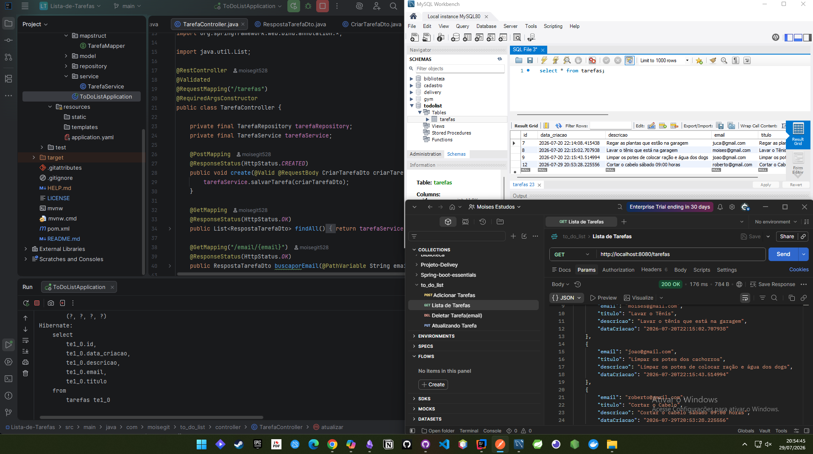
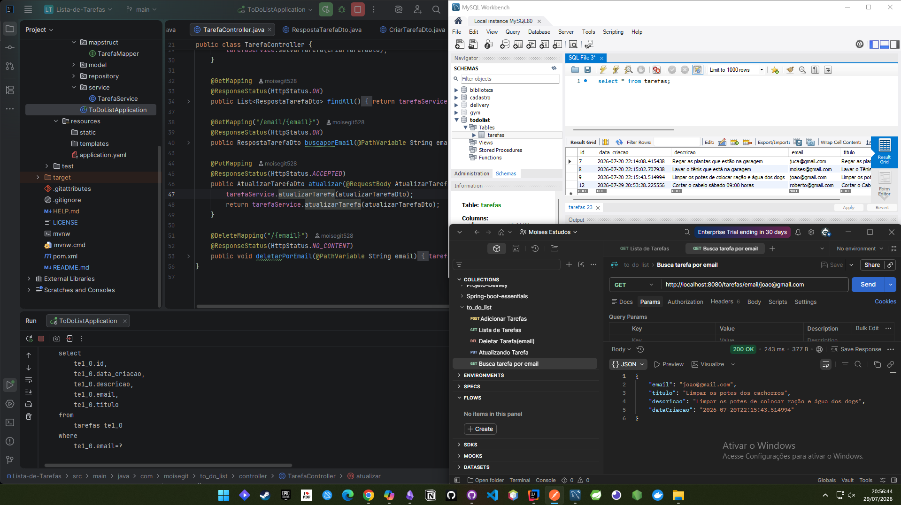
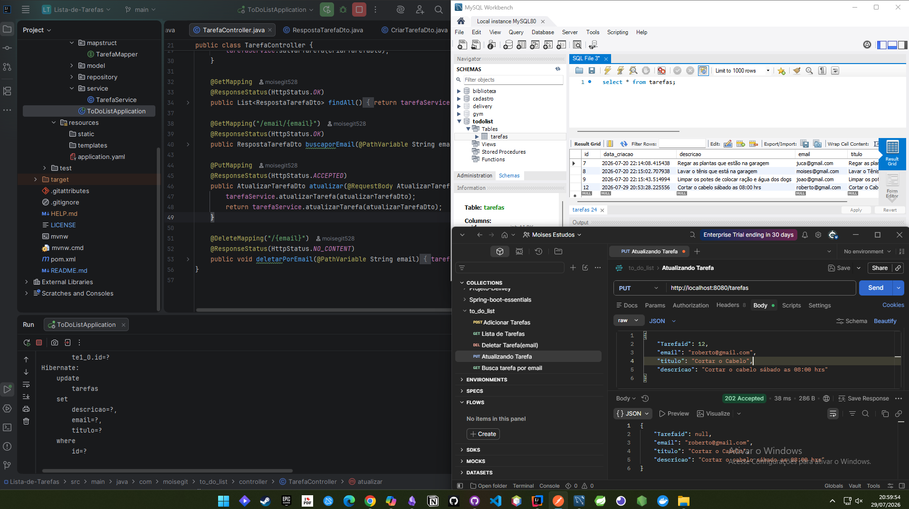
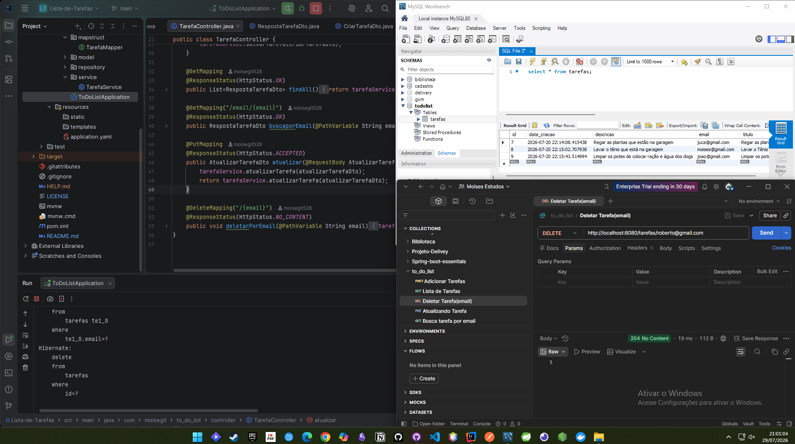

<<<<<<< HEAD
# Lista-de-Tarefas_APIREST
API REST em Spring Boot para gerenciamento de tarefas, com CRUD, MapStruct e tratamento de exceções.
=======
# Lista de Tarefas - API REST

Projeto desenvolvido em **Spring Boot** com CRUD completo para gerenciamento de tarefas.  
Utiliza **JPA/Hibernate**, **MapStruct** para mapeamento de DTOs e tratamento de exceções.

## 🚀 Tecnologias
- Java 17
- Spring Boot
- Spring Data JPA
- Hibernate
- MapStruct
- Postman (testes)

## 📌 Funcionalidades
- Criar tarefa (POST)
- Listar tarefas (GET)
- Atualizar tarefa (PUT)
- Deletar tarefa (DELETE)

  ## 🧪 Testes no Postman

### GET - Listar todas as tarefas

### GET - Buscar tarefa pelo e-mail

### POST - Adicionar nova tarefa

### PUT - Atualizar tarefa

### DELETE - Apagar tarefa

---

## 🗄️ Banco de Dados MySQL
Essas imagens mostram o banco de dados sendo atualizado conforme as requisições da API.

